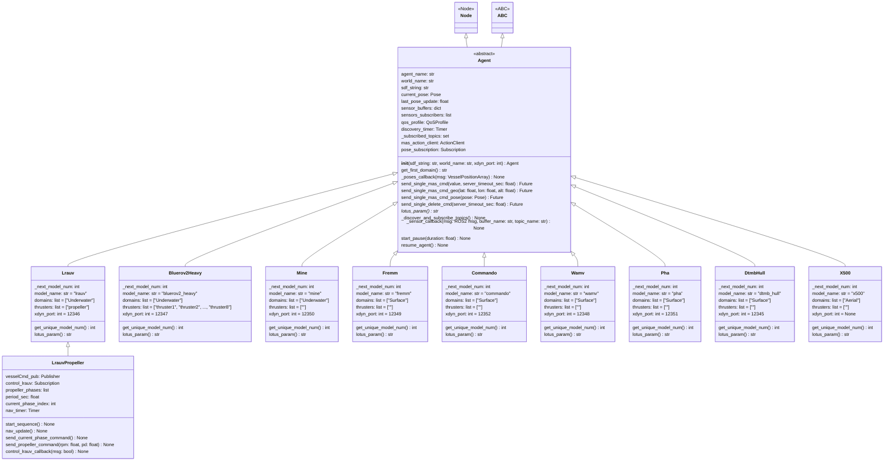
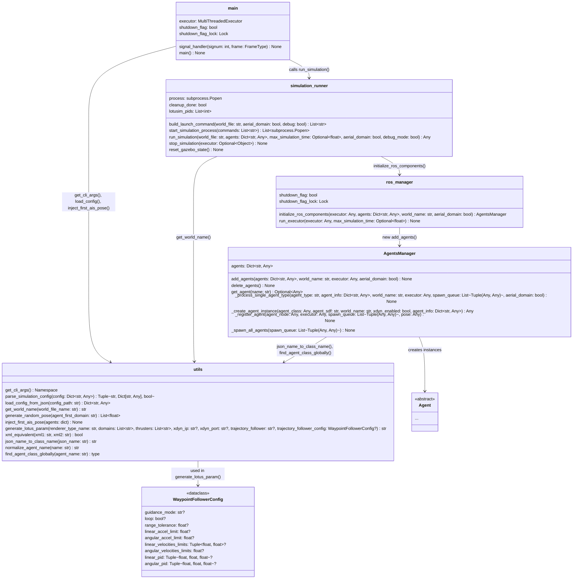
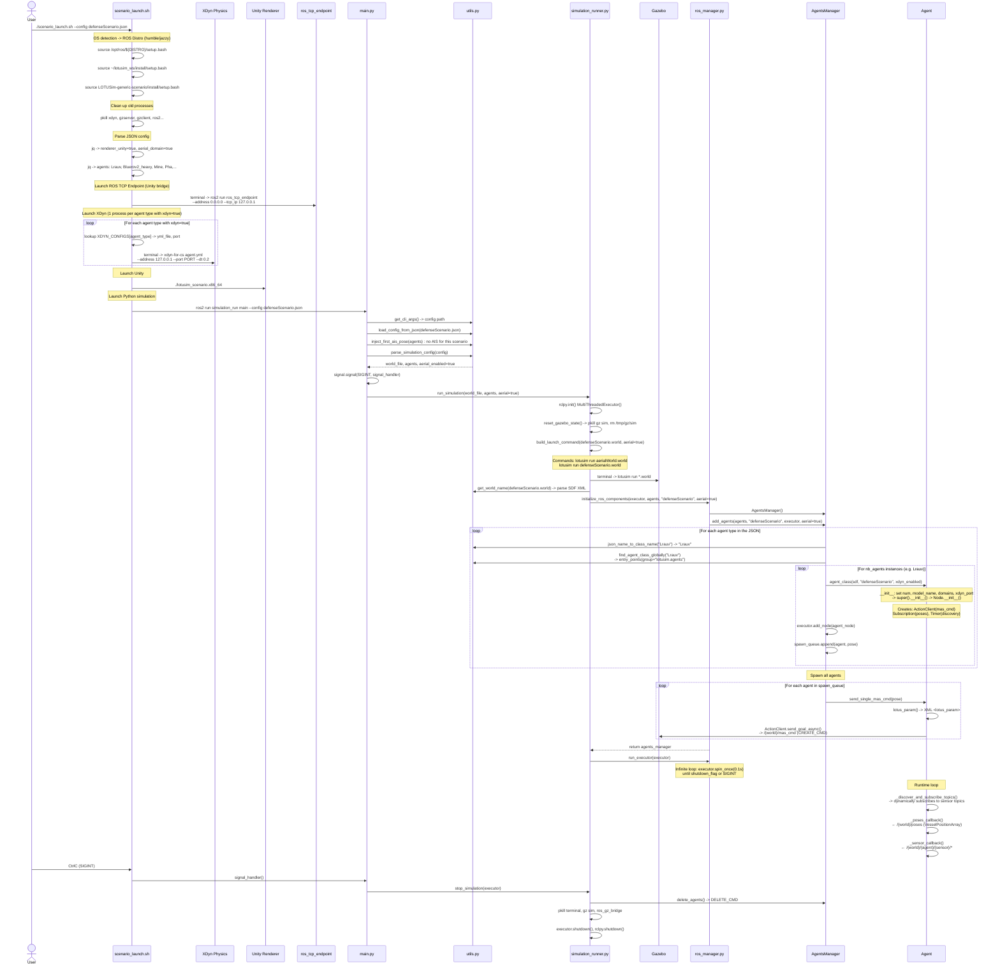
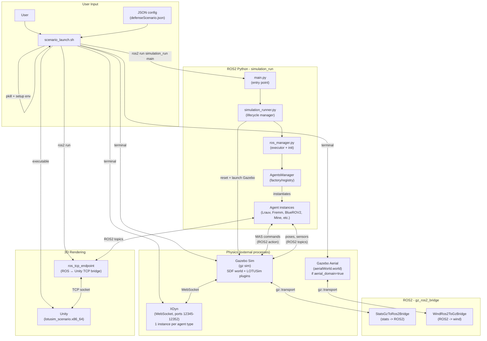

# LOTUSim-generic-scenario - Documentation

## 1. Project Overview

**LOTUSim Generic Scenario** is a multi-agent maritime simulator built on the following stack:

- **ROS 2** (Humble/Jazzy) for inter-process communication
- **Gazebo** for physics simulation and the 3D world
- **XDyn** for the hydrodynamic model (Surface/Underwater via WebSocket)
- **Unity** (optional) for high-fidelity 3D rendering via `ros_tcp_endpoint`

The project enables simulation of naval scenarios with surface vehicles (Fremm, Commando, Wamv, Pha, DtmbHull), underwater vehicles (Lrauv, BlueROV2Heavy, Mine), and aerial vehicles (X500).

> This workspace is a **ROS 2 overlay** on top of the core LOTUSim installed in `~/lotusim_ws`. The core provides physics, SDF/3D assets, and custom messages (`lotusim_msgs`, `lotusim_sensor_msgs`).

---

## 2. Package Tree (`src/`)

| Package               | Language | Role                                                                                    |
|-----------------------|----------|-----------------------------------------------------------------------------------------|
| `simulation_run`      | Python   | **Orchestration core** - entry point, lifecycle management, agent spawning              |
| `agents/*`            | Python   | **Concrete agents** - each vehicle type is an independent ROS 2 package                 |
| `gz_ros2_bridge`      | C        | **Gazebo ↔ ROS 2 bridges** - simulation statistics and wind vector                     |

### Detailed structure of `simulation_run/`

```txt
simulation_run/
├── config/
│   ├── defenseScenario.json    # Multi-agent defense scenario
├── executable/
│   └── scenario_launch.sh      # Bash entry point (the script to run)
└── simulation_run/
    ├── main.py                 # Python entry point (ros2 run simulation_run main)
    ├── simulation_runner.py    # Full lifecycle orchestration
    ├── ros_manager.py          # ROS2 component init, executor loop
    ├── agents_manager.py       # Agent management
    ├── agent.py                # Abstract Agent class (base for all agents)
    ├── utils.py                # Utilities (JSON, SDF, entry points, lotus_param XML)
    └── configs.py              # WaypointFollowerConfig dataclass
```

---

## 3. Class Diagram - `agents/` Package

This diagram shows the complete inheritance hierarchy of agents, with their key attributes and methods.



### Agent summary table by domain

| Domain         | Base Agents                                    | Physics                   |
|----------------|------------------------------------------------|---------------------------|
| **Underwater** | `Lrauv`, `Bluerov2_heavy`, `Mine`              | XDynWebSocket             |
| **Surface**    | `Wamv`, `Fremm`, `Commando`, `Pha`, `DtmbHull` | XDynWebSocket             |
| **Aerial**     | `X500`                                         | Native ROS 2 (no XDyn)    |

### Common pattern for base agents

Each concrete agent follows the exact same pattern:

1. `_next_model_num` (class variable) for auto-incrementing the instance number
2. `get_unique_model_num()` (classmethod) returns and increments the counter
3. `init()` - sets `num`, `model_name`, `renderer_type_name`, `xdyn_port/ip`, `domains[]`, then calls `super().__init__()`
4. `lotus_param()` - delegates to `utils.generate_lotus_param()` with agent-specific parameters

### Dynamic discovery mechanism

Agent classes are **dynamically discovered at runtime** via **ROS 2 entry points** (group `lotusim.agents`). Each agent package declares its classes in `setup.py` -> `entry_points`. The function `utils.find_agent_class_globally()` loads the class by normalized name.

---

## 4. Class Diagram - `simulation_run` Package

This diagram details the orchestration modules and their relationships.



### Orchestration flow explanation

The `simulation_run` package runs in **3 phases**: startup, runtime, and shutdown. Here is the precise call order between modules:

#### Phase 1 - Startup (from `main.py` to agent spawning)

1. **`main.main()`** is the Python entry point, launched by `ros2 run simulation_run main`.
   - Calls `utils.get_cli_args()` to parse `--config` and `--debug`
   - Calls `utils.load_config_from_json()` to load the JSON file
   - Calls `utils.parse_simulation_config()` to extract `world_file`, `agents`, and `aerial_enabled`
   - Registers a signal handler on `SIGINT` (the Unix signal sent by Ctrl+C) to intercept shutdown and perform a clean cleanup
   - Hands off to `simulation_runner.run_simulation()`

2. **`simulation_runner.run_simulation()`** orchestrates the complete lifecycle:
   - Initializes `rclpy` (the ROS 2 Python client library, which allows creating nodes, publishers, subscribers, etc.) and creates a `MultiThreadedExecutor` (the ROS 2 executor that runs all agent nodes in parallel)
   - Calls `reset_gazebo_state()` -> kills old `gz sim` processes and removes `/tmp/gz/sim`
   - Calls `build_launch_command()` -> builds the `lotusim run *.world` commands (2 commands if `aerial_domain=true`, one for the aerial world and one for the main world)
   - Calls `start_simulation_process()` -> launches Gazebo in separate terminals
   - Extracts the `world_name` from the `.world` file via `utils.get_world_name()` (parses the SDF XML to retrieve the `name` attribute of the `<world>` tag)
   - Hands off to `ros_manager.initialize_ros_components()` for agent initialization

3. **`ros_manager.initialize_ros_components()`** initializes the ROS 2 graph:
   - Creates an `AgentsManager`
   - Calls `AgentsManager.add_agents()` with the complete agent dictionary

4. **`AgentsManager.add_agents()`** iterates over each agent type from the JSON:
   - For each type: calls `_process_single_agent_type()` which:
     - Converts the JSON name to a Python class name via `utils.json_name_to_class_name()` (e.g., `"Dtmb_hull"` -> `"DtmbHull"`)
     - Dynamically loads the class via `utils.find_agent_class_globally()` (lookup in ROS 2 entry points, group `lotusim.agents`)
     - For each instance (`nb_agents` times):
       - Calls `_create_agent_instance()` -> instantiates the class with the SDF, world, and xdyn flag. If a `trajectory` is present in the JSON, it is injected via the constructor.
       - Calls `_register_agent()` -> registers the node in the ROS 2 executor and adds it to the spawn queue
   - Once all agents are created: calls `_spawn_all_agents()` -> for each agent, calls `agent.send_single_mas_cmd(pose)` which sends a **ROS 2 action `MASCmd.CREATE_CMD`** to Gazebo to spawn the vehicle in the world

#### Phase 2 - Runtime (main loop)

1. **`ros_manager.run_executor()`** enters the main loop:
   - Calls `executor.spin_once(timeout_sec=0.1)` in an infinite loop
   - The executor runs all registered `Agent` nodes, triggering their timers and callbacks:
     - `_discover_and_subscribe_topics()` - dynamically discovers sensor topics
     - `_poses_callback()` - receives poses from Gazebo
     - `_sensor_callback()` - buffers sensor messages
   - The loop stops when `shutdown_flag = True`, `rclpy.ok() = False`, or `max_simulation_time` is reached

#### Phase 3 - Shutdown (cleanup)

1. When the user presses **Ctrl+C**:
   - `main.signal_handler()` sets `shutdown_flag = True` and calls `simulation_runner.stop_simulation()`
   - `stop_simulation()`:
     - Calls `agents_manager.delete_agents()` -> sends `MASCmd.DELETE_CMD` for each agent
     - Kills Gazebo, terminal, and bridge processes
     - Removes all nodes from the executor, shuts down the executor, then calls `rclpy.shutdown()`

### Role of `utils.py` and `configs.py`

- **`utils`** is a cross-cutting utility module used by `main`, `simulation_runner`, and `AgentsManager`. It is not part of the sequential flow; it is called on-demand for: loading JSON, parsing SDF XML, resolving SDF file paths, generating `<lotus_param>` XML, and dynamically discovering agent classes.
- **`WaypointFollowerConfig`** (in `configs.py`) is a simple `dataclass` that structures the waypoint follower plugin parameters. It is used exclusively by `utils.generate_lotus_param()` when an agent needs a trajectory follower.

---

## 5. Sequence Diagram - Launching the `defenseScenario.json` scenario

This diagram shows **everything that happens** when the user enters:

```bash
./src/simulation_run/executable/scenario_launch.sh --config defenseScenario.json
```



---

## 6. Global Architecture Diagram

Full system view showing all processes, their interconnections, and the protocols used.



---

## 7. ROS 2 Nodes, Topics, and Actions Architecture

### Nodes

| Node                                     | Description                                                                                                      |
|------------------------------------------|------------------------------------------------------------------------------------------------------------------|
| `/lrauv0`, `/commando0`...               | An independent Python node for **each** instantiated agent (inherits from `rclpy.node.Node` via the `Agent` class). |
| `/{world}/gz_entity_management_node`     | Internal Gazebo node managing the lifecycle (entity spawning/deletion) of models in the world.                   |
| `/{world}/physics_plugin`                | Manages the orchestration of Gazebo's base physics simulation (time step, etc.).                                 |
| `/{world}/render_interface`              | Specific bridge communicating with the rendering interface (used to maintain the link with Unity via TCP).       |
| `/{world}/defenseScenario_sensor_system` | Global node managing the sensors integrated in Gazebo.                                                           |
| `/{world}/waypoint_follower`             | Node attached to the Gazebo plugin managing trajectory following for agents (`CommandoTrajectoryFollower`).      |

### Topics

| Topic                                | Message Type                          | Used By                                                            |
|--------------------------------------|---------------------------------------|--------------------------------------------------------------------|
| `/{world}/poses`                     | `lotusim_msgs/VesselPositionArray`    | Pose tracking for all agents (read in `_poses_callback`)           |
| `/{world}/renderer_poses` & `cmd`    | `lotusim_msgs/...`                    | Rendering data exchanges needed for Unity                          |
| `/{world}/lotusim_vessel_array_cmd`  | `lotusim_msgs/VesselCmdArray`         | Low-level thruster commands (rpm, pitch/diameter)                  |
| `/{world}/{agent}/control_lrauv`     | `std_msgs/Bool`                       | Starts or stops the propulsion sequence                            |
| `/{world}/{vessel}/ais_sensor/ais`   | `lotusim_sensor_msgs/AIS`             | Publication of AIS data (lat, lon, SOG, heading)                   |
| `/{world}/{vessel}/imu_sensor/IMU`   | `sensor_msgs/Imu`                     | Basic inertial data (dynamically discovered)                       |
| `/{world}/{vessel}/waypoint_reached` | `lotusim_msgs/WaypointFollowerStatus` | Waypoint crossing notification + path status                       |
| `/{world}/{vessel}/camera`           | `sensor_msgs/Image`                   | Raw video stream from onboard cameras                              |
| `/defenseScenario/sim_stats`         | `lotusim_msgs/SimStats`               | Monitoring simulation timing performance            |
| `/aerialWorld/wind`                  | `lotusim_msgs/Wind`                   | Command to dynamically inject wind into the aerial world           |

### Actions and Services

| Interface Name                | Design Pattern | Type / Msg                        | Used For                                                                                                        |
|-------------------------------|----------------|-----------------------------------|-----------------------------------------------------------------------------------------------------------------|
| `/{world}/mas_cmd`            | **Action**     | `lotusim_msgs/action/MASCmd`      | Spawn ("CREATE_CMD") or delete ("DELETE_CMD") a single agent and its 3D model in the simulator.                 |
| `/{world}/mas_cmd_array`      | **Action**     | `lotusim_msgs/action/MASCmdArray` | Handle a batch of spawns/deletions in a single request to optimize network performance.                         |
| `/{world}/{vessel}/waypoints` | **Service**    | `lotusim_msgs/srv/SetWaypoints`   | Used by the vessel agent to upload its list of waypoints to the Gazebo application plugin.     |
| `.../change_state`            | **Service**    | `lifecycle_msgs/srv/ChangeState`  | Manages the official ROS lifecycle (unconfigured -> active) of each agent's sensors (AIS, IMU).                 |